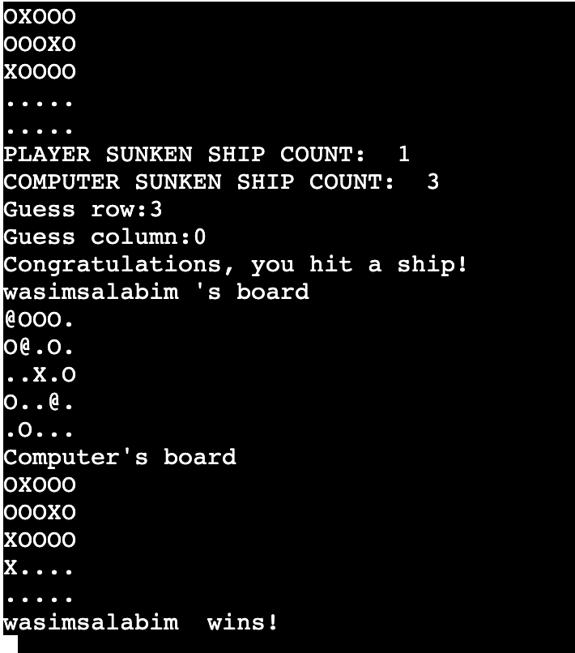

# Wasims Battleships
This is my attempt on the battleships game. The game will be played against the computer
and whoever hits all the ships on the opposite board wins.

Here is the live version of my app: [Wasim's Battleships](https://wasims-battleships.herokuapp.com/)

## How to play

My version of Battleships is based on the classic pen-and-paper game, you can read about it more on: [Wikipedia](https://en.wikipedia.org/wiki/Battleship_(game)).

The player enters a username and then proceeds to place their ships on the board. The player's ships are marked as a "@". The computer's ships are not visible to the player. The game begins when all the ships have been placed: 

The player and the computer take turns to make guesses and try to sink each others battleships.
Missed guesses are marked with an "O" and hits are indicated by an "X".
The winner is the player who sinks all of the opponents ships. 

## Features
- A username input for the player to enter a username. It will be shown throughout the game.

- The player can place their ships wherever they want on their board.

- The computer's ships are placed randomly.
- The player cannot see where the opposing ships are located.
- There is a sunken ships count.

- A message when the game ends.

### Future features
- Have ships larger than 1x1
- Add a restart message where the player can decide to play again

## Data model

All my code was made separetaly since I found it more simple for my knowledge in coding at the moment. For the next project I would like to make an attempt to make classes which would probably make all the code look cleaner. I tried to type in all the functions and prints as clean as possible. I'm happy with the result.

## Testing
I have manually tested this application, and I also asked a friend to try it out. We found some minor errors such as:
- The app stopped working when you entered an invalid command, such as strings or integers outside the 0-4 range.
I managed to fix this by creating a while loop that prevents the app from crashing when entering a command that is out
of bounds.
- There was also an issue with the computer guesses where the computer would guess on the same spaces on the board several times.
This would lead to the game sometimes taking forever and giving the computer a minimal chance of winning the game. I managed to fix this with a while-loop in the function. So in other words, I managed to make the computer smarter.
See screenshots below:

Overall, the code is running with no problems according to PEP8

### Remaining bugs

- No errors are returned when validated through pep8.

## Deployment

This project was deployed using Code Institute's mock terminal for Heroku.

#### Steps for deployment
- Create a new Heroku app
- Set the buildpacks to Python and NodeJS, in that order.
- Link the Heroku app to the repository
- Click on Deploy.

## Credits
- Code institute for the deployment terminal
- Wikipedia for the details of the Battleships game
- Stackoverflow, for code examples.
- Youtube for various guides, explaining functions and how they work.

